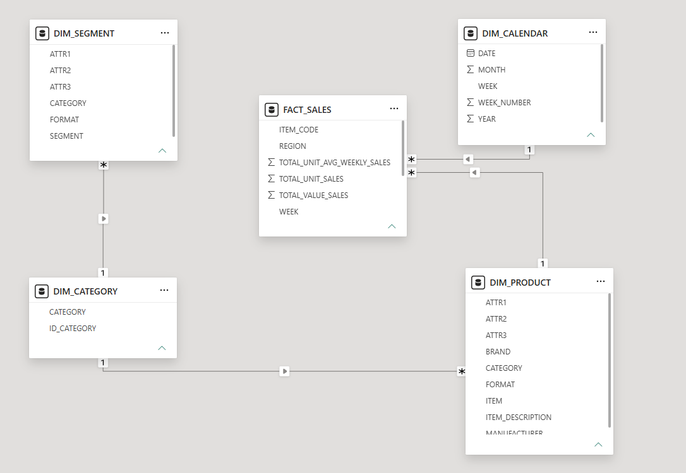

# 1 · Limpieza y Transformación de Datos

## Contexto

Punto de partida del proyecto. Los datos de ventas provienen de **cinco fuentes distintas** organizadas en un **esquema de estrella** (una tabla de hechos rodeada de dimensiones). Antes de cualquier análisis, es necesario consolidarlas en un único dataset limpio y consistente.

## Datos

| Tabla | Registros | Rol |
|-------|-----------|-----|
| `FACT_SALES` | 122,002 | Hechos: ventas semanales por producto y región |
| `DIM_PRODUCT` | 505 | Marca, fabricante, formato y atributos del producto |
| `DIM_CALENDAR` | 156 | Mapeo de la semana a fecha |
| `DIM_SEGMENT` | 53 | Segmento de producto |
| `DIM_CATEGORY` | 5 | Catálogo de categorías |

## Metodología

1. **Tratamiento de valores nulos** — se eliminaron filas sin llave (`dropna`) y se rellenaron atributos faltantes con `"no definido"`.
2. **Eliminación de duplicados** — `drop_duplicates` en cada tabla y en el consolidado.
3. **Estandarización de texto** — `strip()` + `lower()` en marcas, productos y atributos, de modo que `"Vanish"` y `"vanish "` se traten como el mismo valor.
4. **Limpieza de categorías** — eliminación de saltos de línea (`\r\n`) y espacios en la columna `CATEGORY`.
5. **Conversión de tipos** — columnas categóricas a tipo `category`; año a numérico.
6. **Estandarización de fecha/semana** — extracción de semana y año del código `WEEK` (ej. `"34-22"`), con una **validación de calidad**: se verificó que el número de semana reportado coincidiera con la semana ISO de la fecha real.
7. **Consolidación** — unión de las cinco tablas por sus llaves del esquema de estrella.

## Resultado

Un dataset consolidado y limpio (`entregable 1.csv`) en el que cada venta queda enriquecida con su marca, categoría, segmento y fecha, listo para el análisis exploratorio y el modelado.

> **Nota de diseño:** en esta etapa se conservan todas las regiones. La columna `REGION` contiene las 6 áreas y además `TOTAL AUTOS SCANNING MEXICO` (el total nacional). La decisión de qué usar se toma en cada análisis posterior para no duplicar cifras.

---

*Proyecto Final — Empresa Aliada · Diplomado de Ciencia de Datos, EBAC.*  
*Autor: **Luis Enrique Hernández Segura***
