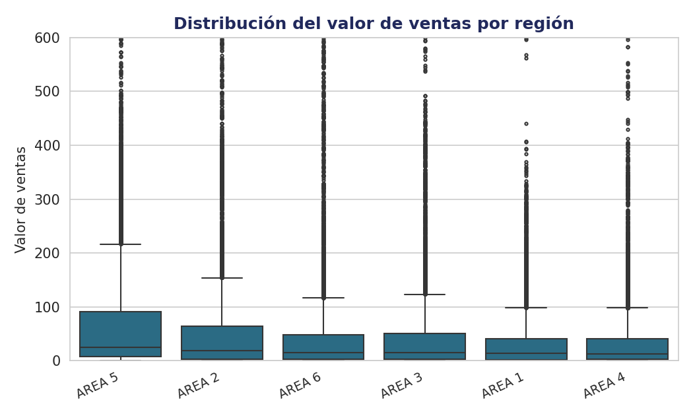
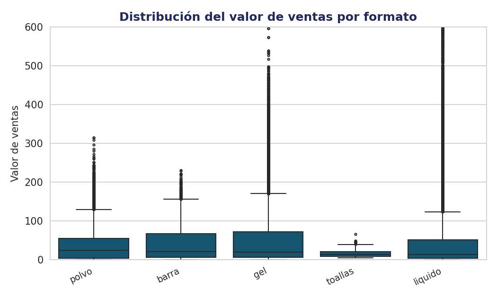
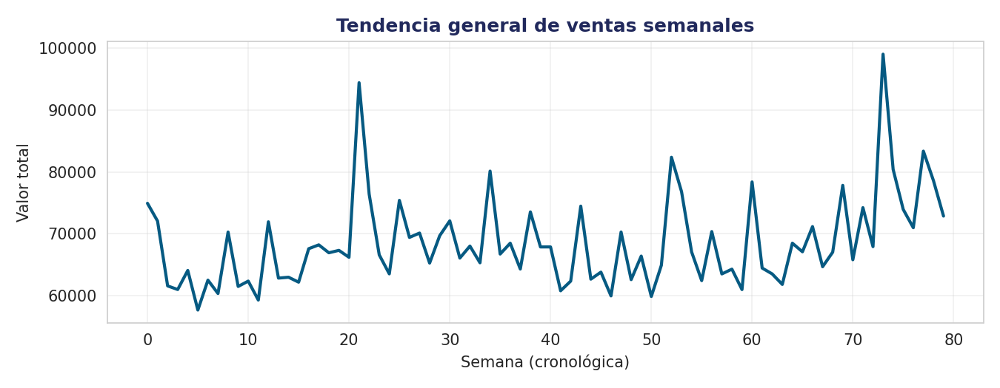
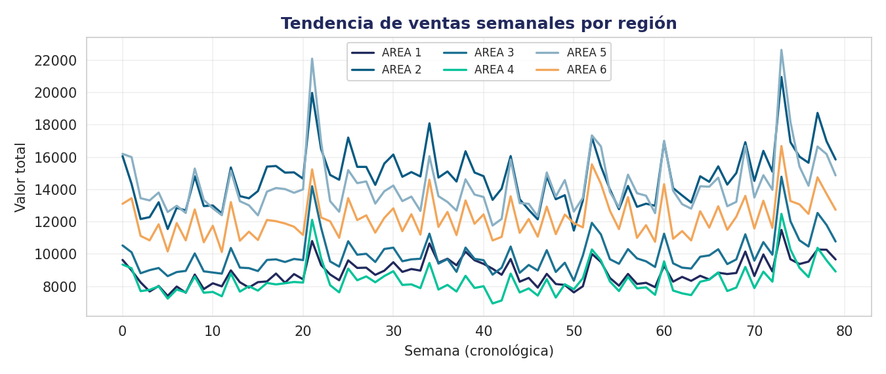
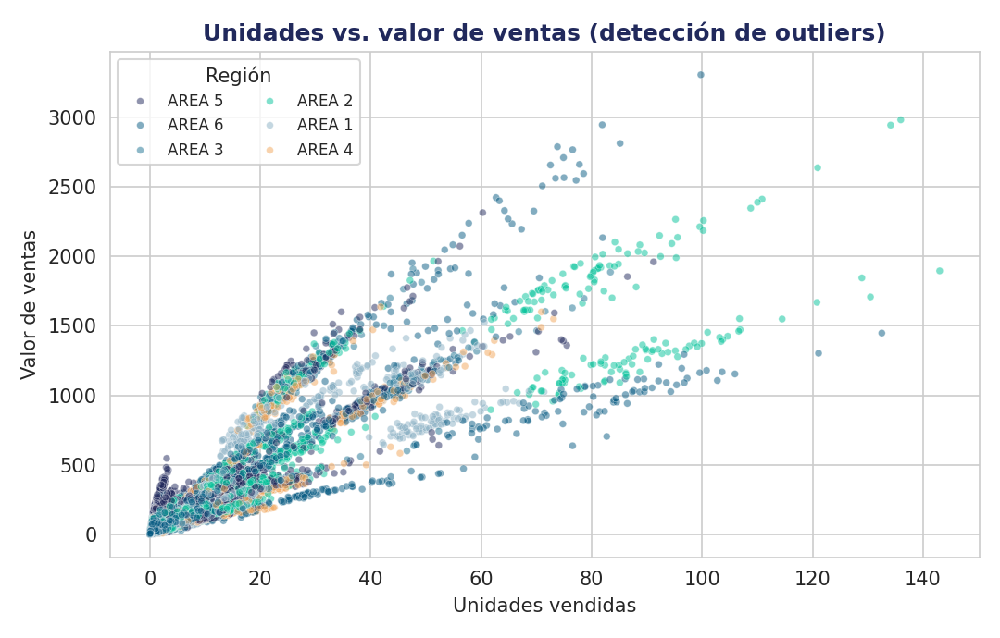

# 2 · Análisis Exploratorio de Datos (EDA)

## Contexto

Exploración del dataset consolidado para entender **cómo se distribuyen las ventas**, su **evolución en el tiempo** y la presencia de **valores atípicos**, antes de modelar.

## Datos

Dataset consolidado del paso anterior. **Se utilizan únicamente las 6 áreas de venta**, excluyendo el total nacional (`SCANNING MEXICO`) para evitar duplicar los valores.

## Metodología

Visualizaciones con **Matplotlib** y **Seaborn**: boxplots de distribución, gráficos de línea para tendencias y gráficos de dispersión para outliers.

## Resultados

### Distribución de ventas
La mayoría de las ventas son de bajo valor con una larga cola de valores altos. Entre regiones el nivel es parejo; el formato **líquido** concentra las ventas de mayor valor.

### Tendencias
Las ventas fluctúan alrededor de un nivel estable con picos recurrentes. Las seis regiones se mueven **en paralelo** (las campañas nacionales impactan a todas por igual), con **Área 2 y Área 5** consistentemente arriba.

### Outliers
Relación lineal fuerte entre unidades y valor; los valores atípicos corresponden a los **SKU de gran formato** (Cloralex 3750 ml, Clorox).

## Conclusiones

- **Área 2 y Área 5** lideran las ventas (juntas ~42%), aunque las regiones están relativamente parejas.
- El **formato líquido** representa ~68% del valor y el segmento **bleach** ~69%.
- Existen outliers de alto valor que conviene analizar por separado.

---

*Proyecto Final — Empresa Aliada · Diplomado de Ciencia de Datos, EBAC.*  
*Autor: **Luis Enrique Hernández Segura***
