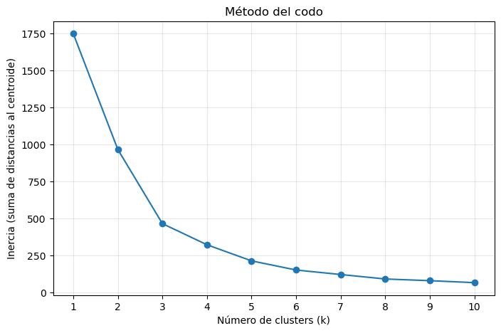
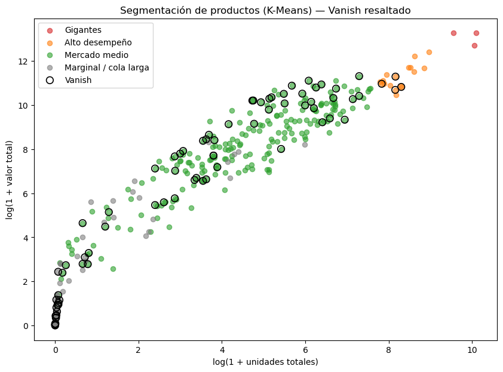

# 3 · Segmentación de Productos con K-Means

## Contexto

Agrupar los **350 productos** del mercado en segmentos de desempeño comercial, para identificar dónde se posiciona la marca Vanish y qué oportunidades existen.

## Datos

Ventas agregadas **por producto** (solo 6 áreas), con cuatro variables: valor total, unidades totales, **alcance** (número de áreas donde se vende) y **continuidad** (número de semanas con ventas).

## Metodología

1. **Estandarización** de las variables con `StandardScaler`.
2. **Método del codo** (inercia para k = 1…10) para elegir el número óptimo de clusters.
3. Ajuste del modelo **K-Means** con `k = 4`.

El codo se forma claramente en **k = 4**, indicando cuatro niveles de desempeño diferenciados.

## Resultados

| Segmento | Productos | Valor mediano | Vanish |
|----------|-----------|---------------|--------|
| **Gigantes** | 3 | $569,617 | 0 |
| **Alto desempeño** | 17 | $65,458 | 4 |
| **Mercado medio** | 236 | $3,789 | 59 |
| **Marginal** | 94 | ~$0 | 14 |

## Conclusiones

- De los **77 productos Vanish**: 59 en el mercado medio (su base), 4 estrellas de alto desempeño, 14 en la cola marginal y 0 entre los gigantes (territorio de blanqueadores como Cloralex).
- El factor que separa a un producto fuerte de uno marginal es la **cobertura geográfica y la continuidad**, no el formato.
- Los **14 SKU marginales** de Vanish representan una oportunidad clara: ampliar su distribución o depurarlos del portafolio.

---

*Proyecto Final — Empresa Aliada · Diplomado de Ciencia de Datos, EBAC.*  
*Autor: **Luis Enrique Hernández Segura***
