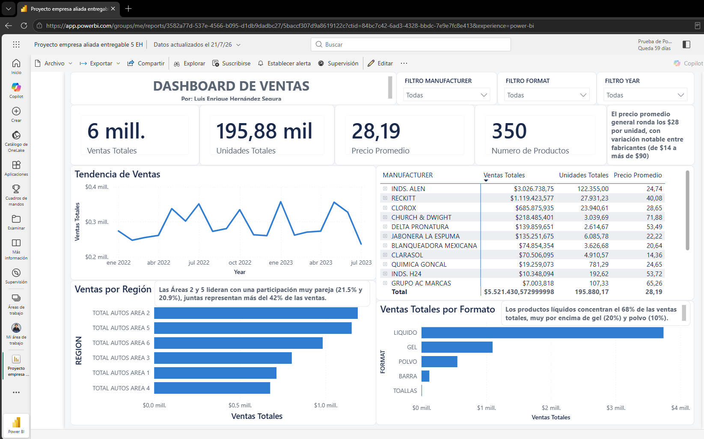

# 5 · Dashboard Interactivo en Power BI

## Contexto

Tablero de negocio que **consolida los hallazgos** del proyecto y permite explorarlos de forma interactiva, orientado a la toma de decisiones.

## Datos

Modelo en estrella cargado en Power BI, usando únicamente las 6 áreas de venta.

## Estructura del dashboard

- **Resumen de ventas (KPIs):** ventas totales, unidades, precio promedio y número de productos.
- **Tendencia de ventas** en el tiempo.
- **Desempeño por fabricante** (tabla dinámica, con Reckitt —dueño de Vanish y Lysol— incluido).
- **Análisis geográfico:** ventas por región.
- **Ventas por formato.**
- **Filtros interactivos:** por fabricante, formato y año.

## Resultados

El tablero refleja los indicadores clave del negocio: un total nacional de **$5.52M** y **195,880 unidades** sobre **350 productos**, con Área 2 y Área 5 al frente y el formato líquido concentrando el 68% de las ventas.

## Archivos

- `Proyecto empresa aliada entregable 5.pbix` — archivo de Power BI.
- `Guia Navegacion Dashboard.pdf` — guía de uso del tablero.

---

*Proyecto Final — Empresa Aliada · Diplomado de Ciencia de Datos, EBAC.*  
*Autor: **Luis Enrique Hernández Segura***
