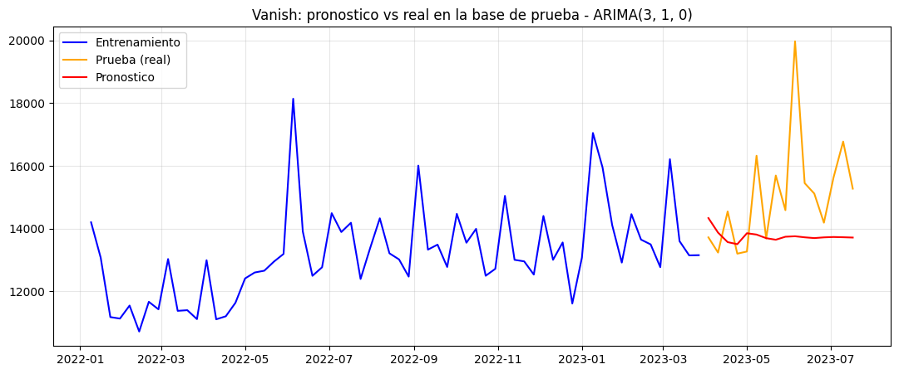
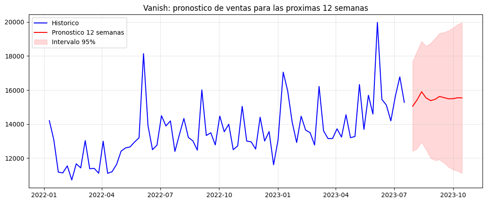
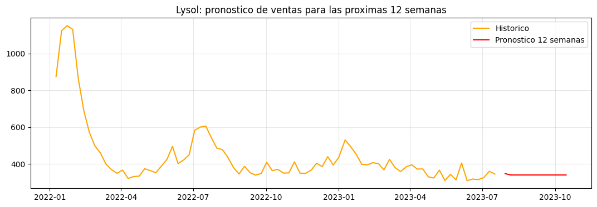

# 6 · Predicción de Ventas con Machine Learning

## Contexto

Desarrollo de un modelo predictivo para **pronosticar las ventas futuras** de las marcas clave Vanish y Lysol, como apoyo a la planeación de inventario y producción.

## Datos

Serie de tiempo semanal de ventas por marca (total nacional), de aproximadamente dos años.

## Metodología

Se eligió un modelo de **series de tiempo ARIMA** (los datos son una serie temporal sin variables explicativas externas para una regresión):

1. **Prueba de Dickey-Fuller** para determinar el grado de diferenciación (`d`).
2. **Criterio de información de Akaike (AIC)** para seleccionar los órdenes `p` y `q`.
3. **Validación** con MSE, MAE y MAPE sobre una base de prueba.
4. **Optimización:** se probó una transformación logarítmica; la mejora fue marginal (MAPE 8.99% vs 9.55%), por lo que se conservó el modelo original por simplicidad.

## Resultados

| Marca | Modelo | MAPE | Interpretación |
|-------|--------|------|----------------|
| **Vanish** | ARIMA(3,1,0) | 9.55% | Marca estable y predecible |
| **Lysol** | ARIMA(0,1,2) | 25.86% | Marca en declive, menos predecible |

Métricas completas de Vanish: **MSE 4,548,715 · MAE 1,556 · MAPE 9.55%**.

### Validación (Vanish)

### Pronóstico a 12 semanas

## Conclusiones

- **Vanish** tiene una demanda estable y su pronóstico es confiable a corto plazo (~10% de error).
- **Lysol** está en declive (de ~$1,100 a ~$330/semana) y su pronóstico debe tomarse con reserva.
- **Recomendación:** usar estos pronósticos para planear inventario y producción, actualizando el modelo conforme llegan datos nuevos. Para mayor precisión, un siguiente paso sería incorporar variables externas (precio, promociones) en un modelo ARIMAX.

---

*Proyecto Final — Empresa Aliada · Diplomado de Ciencia de Datos, EBAC.*  
*Autor: **Luis Enrique Hernández Segura***
